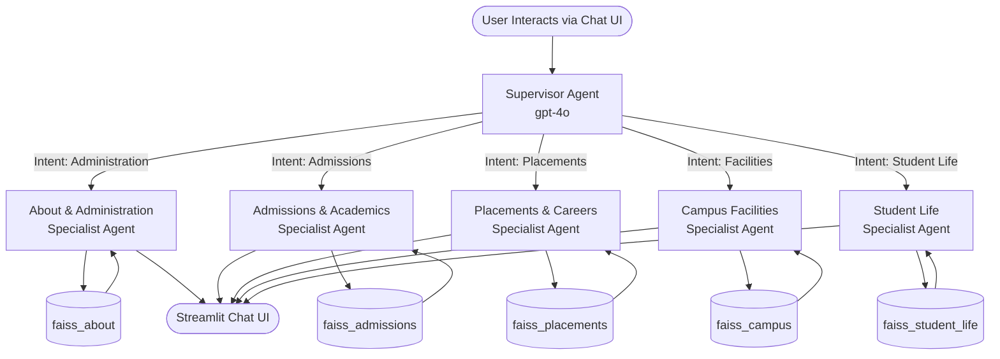

# VVIT Student Helpdesk — Architecture & System Design

The VVIT Student Helpdesk is an advanced **Multi-Agent Retrieval-Augmented Generation (RAG)** application. The system securely and accurately extracts information directly from the official VVIT university website (`vvitu.ac.in`) and serves it through a conversational AI interface.

Designed for the **SaptaMind Agentic AI Mastery Program**, this project highlights how distinct, specialised autonomous agents can collaborate to prevent hallucinations and provide precise, contextually-aware responses with source citations.

---

## High-Level System Architecture

---

## Core Components

### 1. Data Ingestion Pipeline (`scraper.py`)
- **Challenge:** The `vvitu.ac.in` website is a dynamically loaded **React Single Page Application (SPA)**, meaning traditional HTML scraping methods (like `requests` or `wget`) only return the `

` shell.
- **Solution:** Employs **Playwright** (a headless Chromium driver) to physically render each URL, allow the Javascript to hydrate, and extract the raw, readable text.
- **Scope:** Crawls and extracts over 55 unique, categorised URLs across all 5 major university domains.

### 2. Semantic Embedding & Vector Storage (`build_index.py`)
- **Embedding Model:** `text-embedding-3-small` (OpenAI).
- **Vector Database:** 5 parallel **FAISS** in-memory indices.
- **Semantic Isolation:** By physically separating the vector stores into specific domains (e.g., separating Admissions from Placements), the agents intrinsically avoid hallucination and cross-contamination (ensuring a question about hostel fees doesn't inadvertently pull data about tuition fees).

### 3. Multi-Agent Orchestration (`agents.py`)
The system follows the **Supervisor Agent Pattern** built on **LangGraph**.
- **Supervisor Agent:** A highly-focused instruction-following model that evaluates the user's intent, examines the recent conversation memory context, and routes them to exactly one of the five deterministic domains.
- **Specialist Agents:** Once routed, the specialist retrieves the top 5 most relevant semantic chunks *solely* from its designated FAISS index. It enforces its specific persona, embeds the source URLs, and streams the context-rich answer back to the UI.

### 4. Interactive Interface (`app.py`)
- **Framework:** Streamlit
- **Features:** Maintains multi-turn conversation memory, displays route agent badges in real-time, features clickable suggested queries (category-grouped via tabs), and renders markdown and emojis natively.

---

## Tech Stack Summary
- **Orchestration:** LangGraph, LangChain (`langchain_core` for Message APIs)
- **LLM Engine:** OpenAI `gpt-4o`
- **Retrieval Engine:** Meta FAISS, `text-embedding-3-small`
- **Data Engineering:** Playwright, BeautifulSoup4
- **Interface:** Streamlit
- **Observability:** LangSmith (for trace analytics, real-time debugging, and demo evaluations)
