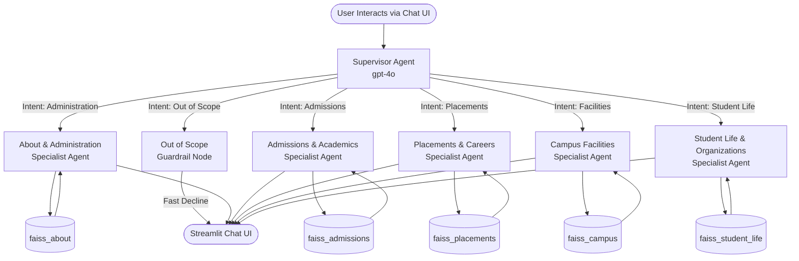

# VVIT Student Helpdesk — Architecture & System Design

The VVIT Student Helpdesk is an advanced **Multi-Agent Retrieval-Augmented Generation (RAG)** application. The system securely and accurately extracts information directly from the official VVIT university website (`vvitu.ac.in`) and serves it through a conversational AI interface.

Designed for the **SaptaMind Agentic AI Mastery Program**, this project highlights how distinct, specialised autonomous agents can collaborate to prevent hallucinations and provide precise, contextually-aware responses with source citations.

---

## High-Level System Architecture

---

## Technical Hardening (v2.0 Enhancements)

### 1. Advanced Retrieval: MMR & Top-K Expansion
To solve the **"List Fragmentation"** issue (where the LLM only sees the first few results of a long list), we implemented:
- **Expanded Context Window**: Retrieval now pulls `k=15` chunks instead of 5.
- **Maximal Marginal Relevance (MMR)**: Replaced standard similarity search with MMR. This penalizes visually similar chunks from the same page, forcing the vectorizer to pick diverse results from across the university's different department pages.

### 2. Context & Metadata Enrichment
To eliminate the **"Lost Context"** problem for specific roles (like Registrar or Chancellor), every chunk now undergoes **Forced Metadata Injection** in the `build_index.py` pipeline:
- Every chunk is prepended with `Page Title: [Name]` and `Source: [URL]`.
- This ensures that a chunk about a person's biography still contains their official title in the semantic vector.

### 3. Temporal Awareness & Dashboard Locking
To ensure the AI doesn't mix up statistics from different years:
- **Temporal Prompting**: The system date (March 2026) is injected into every agent prompt.
- **Absolute Attribution**: The scraper now prepends academic year labels (e.g., `[AY. 2024-2025]`) to every single row of table data and dashboard summary.

---

## Core Components

### 4. Data Ingestion Pipeline (`scraper.py`)
- **Challenge:** The `vvitu.ac.in` website is a dynamically loaded **React SPA**.
- **Solution:** Employs **Playwright** with a `networkidle` lifecycle event to guarantee React hydration before extraction.
- **Interaction Scraper**: Includes specialized logic to programmatically click "Academic Year" tabs on the statistics dashboard, uncovering hidden historical data.

### 5. Multi-Agent Orchestration (`agents.py`)
The system follows the **Supervisor Agent Pattern** built on **LangGraph**.
- **Supervisor Agent:** A highly-focused model that evaluates intent and recent memory.
- **Defensive Guardrail (`out_of_scope`)**: Instantly deflections non-university queries (coding, weather, malicious prompts) to save costs and maintain a professional university persona.
- **Specialist Agents**: Own specific FAISS indices. Answers include clickable source expanders and vertically formatted bullet points.

### 4. Interactive Interface (`app.py`)
- **Framework:** Streamlit
- **Features:** Maintains multi-turn conversation memory, displays route agent badges in real-time, features clickable suggested queries (category-grouped via tabs), and renders markdown and emojis natively.

---

## Tech Stack Summary
- **Orchestration:** LangGraph, LangChain (`langchain_core` for Message APIs)
- **LLM Engine:** OpenAI `gpt-4o`
- **Retrieval Engine:** Meta FAISS, `text-embedding-3-small`
- **Data Engineering:** Playwright, BeautifulSoup4
- **Interface:** Streamlit
- **Observability:** LangSmith (for trace analytics, real-time debugging, and demo evaluations)
